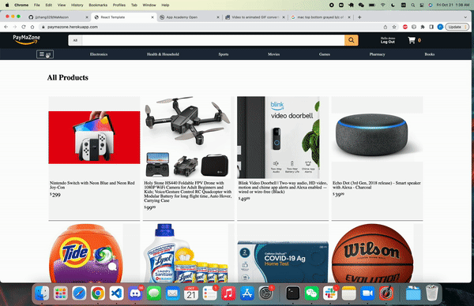
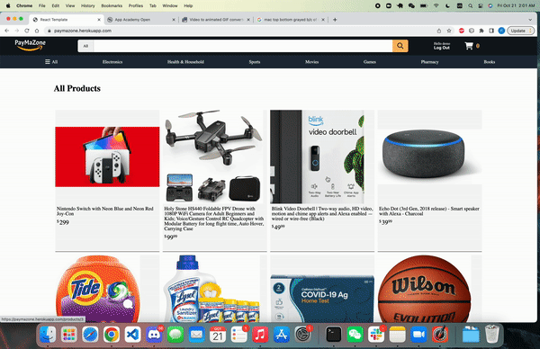

# Welcome to [PayMaZone][1]
PayMaZone is an Amazon clone, where people can visit and buy items in their desire

# Technologies Used
* Ruby on Rails
* React / Redux
* JavaScript
* JBuilder
* PstgreSQL
* HTML 5 and CSS
* AWS S3/IAM

# Features

- Category Show Page
Nav bar shows different categories users can go through and directs them to all products of that category



```
const dispatch = useDispatch();
const categories = useSelector(getCategories);
const categoryList = categories.map(category => <li className="nav-category-li" key={category.id}>
        <Link className="nav-category-link" to={`/category/${category.id}`} >
                {category.name}
        </Link> 
    </li>)

useEffect(()=>{
    dispatch(fetchCategories());
}, [dispatch])
```

- Product Show Page

Click on any of the products picture would direct users to the product show page where users can add the products to cart with quantity selected, and can continuously add to cart unless the total number of the same product reaches max limit


```
// add to cart function
const addToCart = (e) => {
    e.preventDefault();
    if (sessionUser) {
        if (carts.every((cart)=> {
            if (cart.productId === product.id) {
                if (cart.quantity + parseInt(quantity) > 10) {
                    alert("Provider limited purchasing amount no greater than 10 of the kind")
                    return false;
                }
                setMaxQuantity(false);
                dispatch(updateCart({
                    id: cart.id,
                    userId: sessionUser.id, 
                    productId: product.id, 
                    quantity: cart.quantity + parseInt(quantity)})
                )
                return false;
            } else {
                return true
            }
        })) {
            dispatch(createCart({
                userId: sessionUser.id, 
                productId: product.id, 
                quantity: quantity})
            );
        }
    } else {
        history.push("/login");
    }
}
```

- Cart Show Page

Users after logged in can view their products added to cart by clicking on the top left cart icon and will be directed to their cart page. User can change the quantity of items added to the cart and will have a sub total displayed.



```
// Cart show page
const sessionUser = useSelector(state => state.session.user);
const carts = useSelector(state=> state.carts);
const cartItems = Object.keys(carts).length;
let total = 0;
let totalItems = 0;
let cartList = [];
if (sessionUser) {
    if (cartItems) {
        cartList = Object.values(carts).map(cart=> {
            console.log(cart);
            total += (cart.price * cart.quantity);
            totalItems += cart.quantity;
            return <CartIndexItem key={cart.id} cart={cart} />
        })
    }
}
```

```
// Cart Items
const dispatch = useDispatch();
const productId = cart.productId;
const product = useSelector(getProduct(productId));
const [quantity, setQuantity] = useState(cart.quantity);
const optionList = []
for (let i = 1; i <= 10; i++) {
    optionList.push(
        <option key={i} value={parseInt(i)}>{i}</option>
    )
}

useEffect(()=>{
    dispatch(fetchProduct(productId))
}, [dispatch, productId])

useEffect(()=>{
    dispatch(updateCart({...cart, quantity: quantity}));
}, [dispatch, quantity])

const handleRemove = (e) => {
    e.preventDefault();
    dispatch(deleteCart(cart.id));
}
```

[1]: https://paymazone.herokuapp.com/